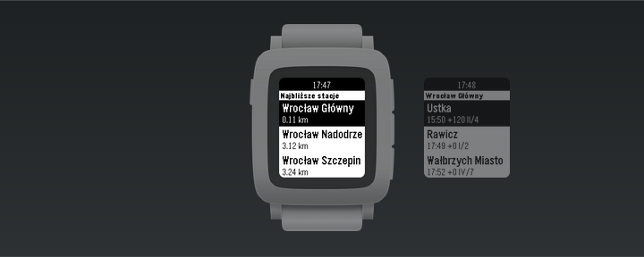

# Rozkład jazdy pociągów (Train Timetable) for PebbleOS

The app shows the closest stations and departures with delays, platform and track numbers. It primarily uses the local backend in `backend/`, which serves data from the official [PDP API](https://pdp-api.plk-sa.pl/swagger/index.html) (dane kolejowe PKP PLK), and falls back to the unofficial [API Bilkom](https://kalkulatorkolejowy.pl/bilkom) when the backend is unreachable or does not know a station. The app bases on [PebbleRail](https://github.com/jccit/pebblerail).

[Link to the Rebble Store](https://apps.rebble.io/en_US/application/68a759a7652aec0009f26c41)